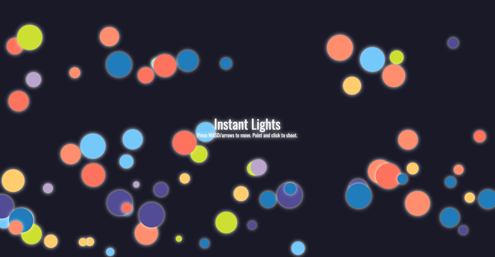

  

### Description

Instant Lights is a simple shooting game.

### How to play
Move with arrow/wasd keys, and shoot with left click.  
You can protect yourself with right click, and eliminate with shift key. (Yet, these commands need time to recharge.)  
There's no specific ending, but you will definitely be addicted once you start playing. 

### Technology
Built with:  
    - HTML5(canvas)  
    - CSS  
    - JavaScript(anime.js, gsap)  

<a href="https://sumi0820.github.io/instant-lights/" target="_blank">Demo</a>  
<a href="https://github.com/sumi0820/instant-lights" target="_blank">Source</a>

---
