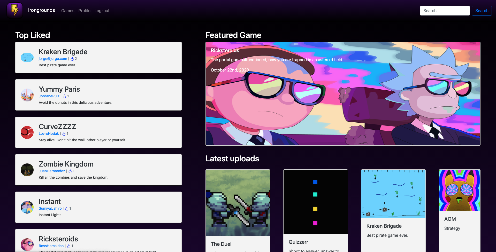

### Description

Developed this server-side rendering web site during a second project week at a coding bootcamp Ironhack. I was mainly in charge of front end side.

Irongrounds is an online gaming platform where hosts HTML based games. You can play any games as soon as you open the game page without signup.

### Technology

Built with:  
 - HTML5(Handlebars)  
 - Sass  
 - JavaScript  
 - Express.js  
 - MongoDB
 - Bootstrap

<a href="https://irongrounds.herokuapp.com" target="_blank">Demo</a>  
<a href="https://github.com/SantAndresP/irongrounds-portal/tree/main" target="_blank">Source</a>

---
