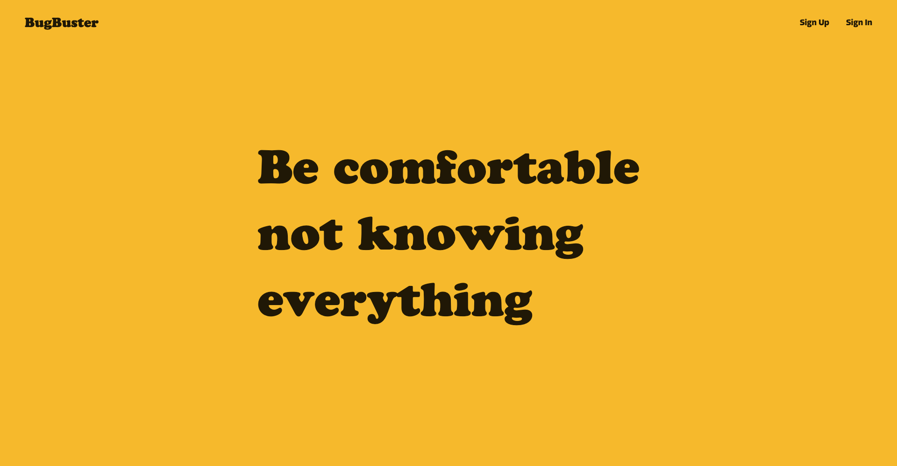

### Description

BugBuster is a question and answer site with a function to manage your projects. 

### How to use
- Post issues you are facing through class activities, LAB, projects.
- Exchange solutions to reply to the post.
- Start your new project, and add tasks that you need to kill!
- LT/TAs can visit open projects and give some feedbacks.
- It's web-based, but responsive!  

Test account
- student view
    - email: steve@gmail.com
    - pass: test12345

- LT/TA view
    - email: microsoft@gmail.com
    - pass: test12345

### Technology
Built with:  
 - HTML5(Handlebars)  
 - Sass  
 - JavaScript(fullPage.js, gsap)
 - Express.js  
 - MongoDB
 - Semantic UI

<a href="https://bugbuster2020.herokuapp.com/" target="_blank">Demo</a>  
<a href="https://github.com/sumi0820/bugbuster" target="_blank">Source</a>

---
