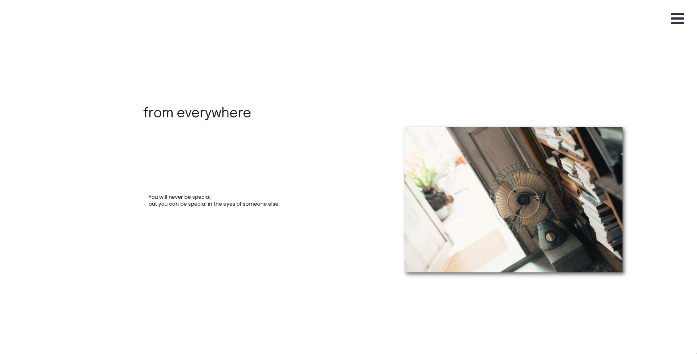
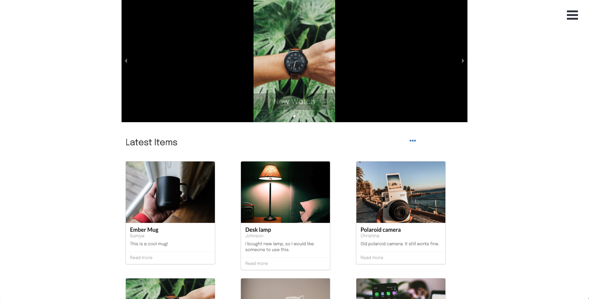

### Description

from everywhere is inspired by a Japanese folk tale called "The straw millionaire".
Post your item that is not to be used anymore, and exchange it with others. Keep exchanging, you may get something you have never expected in the end.

Your thing may help others, you may also be helped by others.
You can start from everywhere. Let's enjoy serendipity in the world!

For your reference:

### How to use
- Open sign in page and login as a test user.
- Upload item that you want to exchange
- Explore items that you are interested in
- Send hi from user profile page
- If the receiver likes your item, he/she will reply and start conversation  

### Technology
Built with:  
 - JavaScript(React.js)
 - Sass  
 - Node.js(Express.js)  
 - MongoDB
 - Semantic UI

<a href="https://from-everywhere.herokuapp.com/" target="_blank">Demo</a>  
<a href="https://github.com/sumi0820/from-everywhere-client" target="_blank">Source</a>

---
